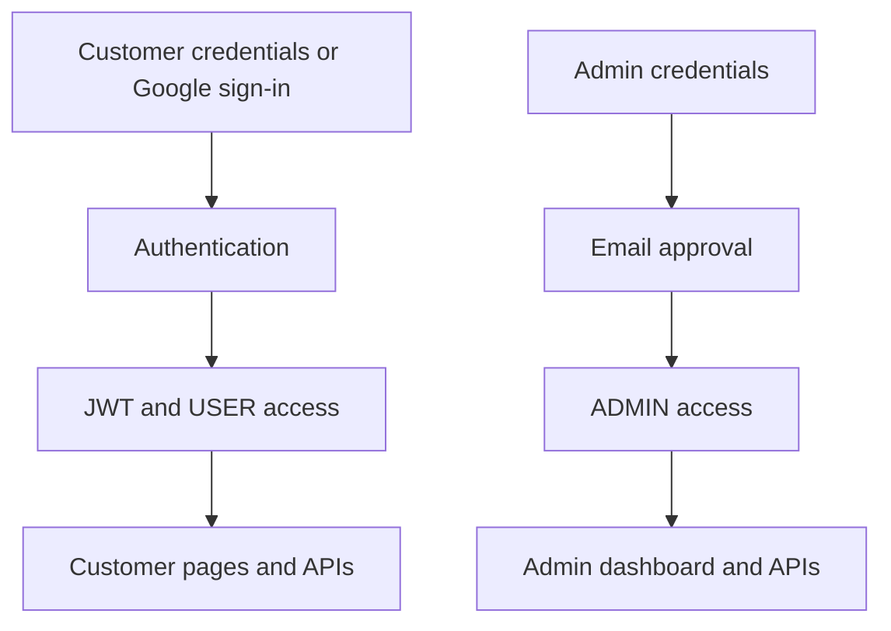

# 🅿️ Park Nova — Smart Parking System

<p align="center">
  
  
  
  
  
  
  
  
</p>

<p align="center">
  <strong>Find Parking • Book a Slot • Navigate • Manage</strong>
</p>

<p align="center">
  A full-stack parking application with customer accounts, parking discovery, bookings, monthly passes, and a separate admin dashboard.
</p>

<p align="center">
  <a href="https://smart-parking-frontend-3fll.onrender.com">
    
  </a>
  <a href="https://github.com/vikashjha06/park-nova">
    
  </a>
</p>

---

## 🖥️ Project Overview

**Park Nova** is a React and Spring Boot application backed by MongoDB. Customers can register, verify their email, sign in, browse parking areas and available slots, create bookings, view payments and refunds, use a wallet, and manage monthly passes. Admins use a separate dashboard to manage parking operations.

The frontend uses a dark navy/black base with neon green, teal, and cyan accents. Its CSS colors include `#040B12`, `#00E676`, `#00C9A7`, and `#00B4FF`.

### 🎯 What makes it different?

> 🔐 JWT-based customer authentication and Google sign-in
>
> 📧 Email verification, password reset, and admin login approval via Gmail API
>
> 🅿️ Parking areas, slot availability, and bookings
>
> 🗺️ Google Maps links for area location and driving directions
>
> 👛 Wallet, payment records, refunds, and monthly passes
>
> 🛡️ Separate protected admin dashboard
>
> ☁️ Frontend and backend hosted on Render

---

## 🌐 Live Preview

### 🚀 Try It Yourself

**Live Frontend:**  
https://smart-parking-frontend-3fll.onrender.com

**Backend Health API:**  
https://smart-parking-backend-161n.onrender.com/api/health

**Privacy Page:**  
https://smart-parking-frontend-3fll.onrender.com/privacy

---

## ✨ Key Features

| Feature | Description |
| :--- | :--- |
| 👤 **Customer Accounts** | Registration, email verification, profile, login, and password recovery |
| 🔐 **JWT Security** | Backend API access tied to authenticated users and roles |
| 🔵 **Google Sign-In** | Customer login using Google OAuth |
| 🅿️ **Find Parking** | Browse parking areas and inspect available slots |
| 🗺️ **Map Directions** | View parking locations and open Google Maps directions |
| 📅 **Bookings** | Create and manage parking bookings |
| 💳 **Payment Records** | Record payment status, view history, and request refunds |
| 👛 **Wallet** | Balance and transaction history |
| 🗓️ **Monthly Passes** | Availability, quotes, pass creation, history, and cancellation |
| 🛡️ **Admin Dashboard** | Manage areas, slots, pricing, bookings, payments, refunds, users, and reports |
| 📧 **Gmail API Emails** | Verification, password reset, admin approval, and notification delivery |
| ☁️ **Render Deployment** | Static frontend and Docker-based backend web service |

### 🅿️ Customer Journey

1. **Create an account:** Register with an email address and confirm it through the verification email, or use Google sign-in.
2. **Discover parking:** Browse parking areas, check slots, and view the area location. The directions link opens Google Maps with that area as the destination.
3. **Book a slot:** Create a booking and track it from **My Bookings**.
4. **Manage activity:** Review payment records and refunds, wallet transactions, and monthly passes from the customer pages.
5. **Recover an account:** Request a password reset email and follow the link to set a new password.

### 🛡️ Admin Workspace

The admin interface starts at `/admin/login` and is separate from customer pages. After the admin enters valid credentials, the registered admin inbox receives an approval request. Approved admins can access the dashboard sections below.

| Section | Purpose |
| :--- | :--- |
| **Parking Areas & Slots** | Configure areas, coordinates, slot inventory, and slot status |
| **Pricing** | Maintain parking pricing records |
| **Bookings & Payments** | Review customer bookings and payment records |
| **Refunds & Wallets** | Review refund requests and wallet activity |
| **Monthly Passes** | Inspect customer passes and cancellation activity |
| **Users & Notifications** | Review accounts and notification records |
| **Reports, Activity & Settings** | View operational summaries, activity logs, and admin settings |

### 👤 Authentication Options

| Customer | Admin |
| :--- | :--- |
| Email/password login | Email/password login with email approval |
| Google sign-in | Separate admin role and dashboard |
| Email verification and password reset | Registered admin inbox receives approval request |

> **Payment implementation:** The repository contains payment records and status endpoints. It does not integrate an external payment gateway or prove that a bank/UPI transaction was processed.

---

## 🛡️ Security Architecture

Spring Security protects the REST endpoints. The app issues JWTs for authenticated requests and separates `USER` and `ADMIN` access. Admin login creates its session only after the approval step sent to the registered admin email.

### Security Flow



---

## 🧰 Technology Stack

| Technology | Role |
| :--- | :--- |
| ⚛️ **React & Vite** | Frontend application and production build |
| 🟧 **HTML5** | Page structure |
| 🟦 **CSS3** | Responsive customer and admin interfaces |
| 🟨 **JavaScript (JSX)** | Interactive UI and API integration |
| ☕ **Java 21** | Backend language specified by `pom.xml` |
| 🟩 **Spring Boot** | REST API, business logic, and server |
| 🍃 **Spring Data MongoDB** | MongoDB repositories and document persistence |
| 🟢 **MongoDB** | Application database |
| 🔐 **Spring Security, JWT & Google OAuth** | Authentication and authorization |
| 📧 **Gmail API** | Application email delivery over HTTPS |
| 🚀 **Render** | Static site and backend web service |

---

## ☁️ Deployment Architecture

- **Frontend:** Render Static Site builds `frontend/` with Vite and rewrites routes to `index.html`.
- **Backend:** Render Web Service builds `backend/` from its Dockerfile; `/api/health` is its configured health check.
- **Database:** MongoDB connection configured with `MONGODB_URI`.
- **Configuration:** The frontend uses `VITE_API_BASE_URL`; the backend uses environment variables for database, JWT, Google OAuth, Gmail API, and frontend URL.

---

## 🔌 API Overview

The backend exposes REST APIs. Some endpoints require a customer JWT or an approved admin session. These are the main route groups, not a complete API reference.

| Route | Purpose |
| :--- | :--- |
| `GET /api/health` | Service health response |
| `/api/auth/*` | Customer registration, login, verification, and password recovery |
| `/api/auth/admin/*` | Admin login and email approval flow |
| `/api/parking/*` | Parking areas and slot availability |
| `/api/bookings/*` | Customer booking operations |
| `/api/payments/*` | Payment records and refund operations |
| `/api/wallet/*` | Wallet balance and transactions |
| `/api/monthly-passes/*` | Pass quotes, availability, creation, and history |
| `/api/admin/*` | Admin management, reporting, and settings |

### ✅ Deployment Checks Performed

The following production flows were checked during deployment on **25 September 2026**:

- Backend `/api/health` returned `{"status":"UP"}`.
- Frontend homepage and privacy page responded successfully.
- Admin login approval email arrived and admin login completed.
- Customer forgot-password email, reset link, password change, and login worked.
- New customer registration email, email verification, and login worked.

These checks describe the deployment on that date; they are not a guarantee of future uptime or coverage for every feature.

---

## 📂 Project Structure

```text
park-nova/
├── backend/
│   ├── src/main/java/com/smartparking/
│   │   ├── config/
│   │   ├── controller/
│   │   ├── dto/
│   │   ├── model/
│   │   ├── repository/
│   │   └── service/
│   ├── src/main/resources/application.properties
│   ├── Dockerfile
│   └── pom.xml
├── frontend/
│   ├── public/images/park-nova-logo.png
│   ├── src/pages/
│   │   ├── admin/
│   │   ├── auth/
│   │   ├── customer/
│   │   ├── home/
│   │   └── legal/
│   ├── package.json
│   └── index.html
├── render.yaml
└── README.md
```

---

## ⚡ Getting Started

### 1. Clone Repository

```bash
git clone https://github.com/vikashjha06/park-nova.git
cd park-nova
```

### 2. Configure Environment

Use Java 21 or later, Maven, Node.js/npm, and a reachable MongoDB database. Set these variables with your own values; do not commit secrets.

| Variable | Purpose |
| :--- | :--- |
| `MONGODB_URI` | MongoDB connection string |
| `MONGODB_DATABASE` | Database name; defaults to `smart_parking` |
| `JWT_SECRET` | JWT signing secret |
| `GOOGLE_CLIENT_ID`, `GOOGLE_CLIENT_SECRET` | Customer Google sign-in client |
| `FRONTEND_URL` | Frontend address; locally `http://localhost:5173` |
| `MAIL_USERNAME` | Gmail sender address |
| `GOOGLE_MAIL_CLIENT_ID`, `GOOGLE_MAIL_CLIENT_SECRET`, `GOOGLE_MAIL_REFRESH_TOKEN` | Gmail API mail client credentials |
| `VITE_API_BASE_URL` | Frontend API address; locally `http://localhost:8080` |

**Current configuration note:** `render.yaml` and `application.properties` still list a legacy `MAIL_APP_PASSWORD` SMTP setting. The current `EmailService` sends through the Gmail API using the three `GOOGLE_MAIL_*` variables. Add those variables to the backend service environment.

### 3. Run Backend

```bash
cd backend
mvn spring-boot:run
```

Local health check: `http://localhost:8080/api/health`.

### 4. Run Frontend

In another terminal from the repository root:

```bash
cd frontend
npm install
npm run dev
```

Local frontend: `http://localhost:5173`.

---

## 📊 Feature Overview

| Access | Main flow | Pages and actions |
| :--- | :--- | :--- |
| **Customer** | Register → verify email → sign in | Profile, Find Parking, My Bookings, Payments, Wallet, Monthly Pass |
| **Google user** | Google OAuth → customer session | Same protected customer pages |
| **Admin** | Admin login → email approval | Dashboard, parking, pricing, users, bookings, payments, refunds, reports |

---

## 🚀 Future Roadmap

The following are **planned ideas**, not features currently available in Park Nova:

- [ ] **Smart Parking Match:** Suggest slots based on vehicle type, price, distance from the destination, and estimated travel time. Show why each slot was recommended.
- [ ] **Arrival-Aware Booking:** Let customers enter an expected arrival time. Send a reminder before the booking starts and show a clear grace period for late arrival.
- [ ] **Automatic Waitlist:** When a parking area is full, let customers join a queue for their selected time. Offer a newly available slot to the next customer for a limited confirmation period.
- [ ] **Quick Rebooking:** Save a vehicle and favorite parking area for repeat trips, while checking the latest availability and price before every booking.
- [ ] **Entry and Exit QR:** Give each booking a short-lived QR code. Staff can scan it at entry and exit to update the booking status and prevent the same code being reused.
- [ ] **Busy-Hour Forecast:** Use past bookings to estimate when a parking area is

---

## 📚 Technical Work Demonstrated

- Spring Boot controllers and services for authentication, parking, bookings, payments, passes, wallet, and admin operations.
- MongoDB document models and repositories.
- React routes and protected customer/admin pages.
- Google OAuth sign-in and Gmail API email delivery.
- Frontend static site and Docker backend deployment on Render.

---

## 👨‍💻 Developer

### Vikash Kumar Jha

**BCA Student | Aspiring Full Stack Java Developer**

### 💻 Skills & Interests

```text
Java
Spring Boot
JavaScript
React
HTML
CSS
MongoDB
Web Development
```

<p align="center">
  <a href="https://github.com/vikashjha06">
    
  </a>
</p>

---

## ⭐ Support the Project

If you like this project:

### ⭐ Star the repository

### 🍴 Fork the project

### 📢 Share it with others

Your support motivates me to build more projects. ❤️

---

<p align="center">🅿️ <strong>Find parking. Book your spot.</strong></p>

<p align="center"><strong>Made with ❤️ by Vikash Kumar Jha</strong></p>

---

<p align="center">
  <a href="https://smart-parking-frontend-3fll.onrender.com">
    🚀 <strong>Explore Live Demo</strong>
  </a>
</p>
